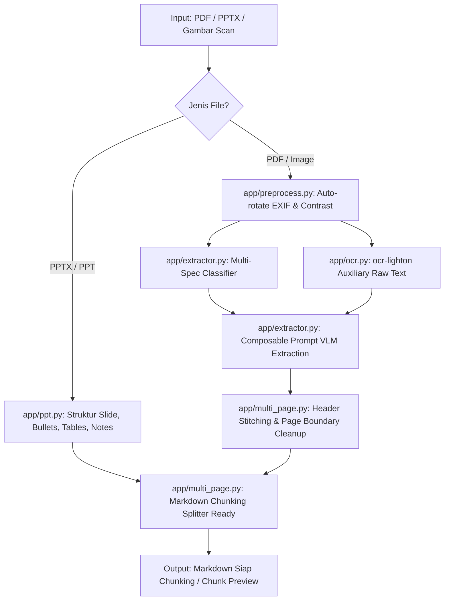

# jds-magang-ocr-agent — Vision OCR & Document Extractor (Ready for Chunking)

Sistem ekstraksi dokumen multimodal (PDF, PPT/PPTX, Scan Gambar) menjadi **Markdown bersih dan terstruktur yang siap langsung di-chunking** untuk pipeline RAG downstream.

> ℹ️ **Catatan Branch:** 
> Fitur lengkap pipeline RAG end-to-end (Embedding `Qwen3-VL-Embedding`, Reranker `Qwen3-VL-Reranker`, dan Vector Store) tersimpan di branch `end-to-end`. Branch `main` difokuskan pada pipeline ekstraksi dokumen ke format Markdown siap chunking.

---

## 🎯 4 Spesifikasi Karakteristik Dokumen (Mendukung Multi-Spesifikasi Komposit)

Sistem mendukung ekstraksi dengan satu atau **beberapa spesifikasi sekaligus secara komposit** (*Composable Prompts*), misalnya jurnal ilmiah multi-halaman yang membutuhkan aturan 2-kolom sekaligus kontinuitas heading antar-halaman (`bilingual_journal` + `markdown_hierarchy`):

| No | Spesifikasi Layout | Karakteristik & Perilaku Ekstraksi | Target Output |
|:---:|:---|:---|:---|
| **1** | `plain` | **Dokumen Biasa / Standar**<br>Dokumen umum (memo, formulir, surat, nota) yang tidak memerlukan perlakuan hierarki khusus. OCR langsung diekstrak menjadi teks/markdown bersih. | Paragraf rapi, tabel standar GFM |
| **2** | `markdown_hierarchy` | **Hierarki Markdown Berkelanjutan**<br>Dokumen bertingkat (`#`, `##`, `###`). Menjaga konsistensi judul ketika berpindah halaman (multi-page) dan menyambungkan kalimat terpotong tanpa merusak struktur. | Hierarki heading utuh, eliminasi page header/footer berulang |
| **3** | `bilingual_journal` | **Jurnal Ilmiah / Dokumen 2-Kolom & 2-Bahasa**<br>Membaca kolom kiri dari atas ke bawah sampai selesai, lalu melanjutkan ke kolom kanan. Menjaga koherensi teks bilingual berdampingan. | Urutan baca logis berurutan (tidak melompat antar-kolom) |
| **4** | `presentation_slides` | **Slide Presentasi (PPT / PPTX / Slide PDF)**<br>Slide yang sarat poin-poin/bullet list, tabel ringkas, speaker notes, serta penanda visual/diagram `[Diagram: ...]`. | Markdown per-slide yang siap dipartisi per topik |

---

## 🤖 Arsitektur Sub-Agent (Deep Agents Harness)

Proyek ini dilengkapi dengan **Master Agent dan 6 Sub-Agent Spesialis** ([app/deep_agent.py](file:///c:/Users/HYPE%20AMD/Documents/Coding/jds-magang/app/deep_agent.py)) yang mendelegasikan tugas secara otonom:

| Nama Sub-Agent | Peran & Spesialisasi | Tool Utama |
|:---|:---|:---|
| `ocr-specialist` | Pembacaan teks mentah literal tingkat tinggi tanpa halusinasi | `ocr_document` (`ocr-lighton`) |
| `layout-classifier` | Deteksi multi-trait tata letak dokumen (kolom, hierarki, slide, tabel) | `classify_layout` |
| `markdown-extractor` | Ekstraksi gambar multimodal ke Markdown bersih berbasis spesifikasi komposit | `extract_to_markdown` |
| `presentation-specialist` | Ekstraksi slide PowerPoint (.pptx) dengan hierarki bullet, tabel, dan notes | `extract_presentation_pptx` |
| `pdf-orchestrator` | Orkestrasi pemrosesan PDF multi-halaman & penyambungan kontinuitas heading | `extract_pdf_document` |
| `chunking-simulator` | Evaluasi kesiapan partisi Markdown dengan header splitter & recursive splitter | `preview_chunks` |

---

## 🔌 Model Context Protocol (MCP) Server & Batch Document Discovery

Server MCP berstandar resmi **MCP Python SDK v2.0** ([app/mcp_server.py](file:///c:/Users/HYPE%20AMD/Documents/Coding/jds-magang/app/mcp_server.py)) menyediakan 8 MCP Tools untuk AI Assistant:

### Daftar MCP Tools:
1. **`scan_document_folders`**: Pindai direktori (mis. `dataset`, `input`, `output`) dan seluruh subfolder untuk mendeteksi folder yang berisi dokumen, jumlah file per ekstensi, dan sample file.
2. **`batch_extract_documents`**: Ekstraksi dokumen massal dari satu/banyak folder terpilih dengan opsi kuota batas jumlah data (`limit` / `limit_per_folder`).
3. **`extract_document_to_markdown`**: Ekstraksi file dokumen tunggal (PDF, PPTX, gambar) ke Markdown siap chunking.
4. **`ocr_image`**: Grounding teks mentah presisi tinggi via model OCR `ocr-lighton`.
5. **`classify_document_layout`**: Deteksi multi-trait spesifikasi tata letak dokumen.
6. **`extract_presentation_pptx`**: Parser file PowerPoint (.pptx/.ppt) ke Markdown terstruktur.
7. **`preview_markdown_chunks`**: Simulasi partisi teks Markdown dengan header metadata.
8. **`run_deep_reasoning_agent`**: Eksekusi agen penalaran dokumen multimodal otonom.

### Konfigurasi `mcp_config.json`:
```json
{
  "mcpServers": {
    "jds-magang-ocr-agent": {
      "command": "c:\\Users\\HYPE AMD\\Documents\\Coding\\jds-magang\\.venv\\Scripts\\python.exe",
      "args": [
        "-m",
        "app.mcp_server"
      ],
      "cwd": "c:\\Users\\HYPE AMD\\Documents\\Coding\\jds-magang",
      "env": {
        "PYTHONPATH": "c:\\Users\\HYPE AMD\\Documents\\Coding\\jds-magang",
        "LLM_BASE_URL": "http://localhost:1234/v1",
        "LLM_API_KEY": "lm-studio",
        "VLM_MODEL": "qwen-35b-vision",
        "OCR_MODEL": "ocr-lighton"
      }
    }
  }
}
```

---

## 🤖 Agent Mode (`app/mcp_agent_server.py`) — Tanpa OCR/VLM/LLM Endpoint

Server MCP khusus untuk **agent model berbasis vision** (Gemini CLI, Claude Desktop, Cursor, dsb.) yang mengerjakan ekstraksi **secara mandiri tanpa memanggil endpoint model apa pun**. OCR, VLM, maupun LLM **dimatikan** — agent-lah yang membaca gambar dokumen dan menulis Markdown-nya sendiri; server hanya menyediakan alat bantu mekanis. Hasil yang disimpan melalui `save_extraction_result` dimaksudkan sebagai **gold data example** untuk melatih agent/LLM lokal di kemudian hari.

> ⚠️ Server ini **tidak** mengandalkan endpoint model. Jika `LLM_BASE_URL`/`VLM_MODEL`/`OCR_MODEL` tidak di-set, server tetap jalan secara mandiri.

### Daftar MCP Tools (Agent Mode):
| No | Tool | Fungsi |
|:---:|:---|:---|
| 1 | `scan_document_folders` | Pindai folder & subfolder untuk menemukan dokumen |
| 2 | `select_document_batch` | Pilih daftar file dengan kuota (limit per folder / total) |
| 3 | `select_random_documents` | Pilih N file **secara acak tanpa duplikasi** (otomatis skip dokumen yang sudah punya gold data) |
| 4 | `render_presentation_slides` | Render slide PPTX → PNG per slide kanvas utuh |
| 5 | `convert_pdf_to_images` | Konversi halaman PDF → JPG per halaman |
| 6 | `preprocess_image` | Perbaikan orientasi EXIF & kontras gambar |
| 7 | `preview_markdown_chunks` | Simulasi chunking untuk validasi |
| 8 | `save_extraction_result` | Simpan Markdown buatan agent + metadata sidecar sebagai gold data |

### Alur kerja yang direkomendasikan (agent):
1. `scan_document_folders` → tampilkan folder dokumen yang tersedia
2. **TANYAKAN KE USER** folder mana yang datanya mau diproses (mis. `input/ppt/english`)
3. **TANYAKAN KE USER** berapa data random yang mau dibuat (tanpa duplikasi)
4. `select_random_documents(folders=<pilihan>, count=<N>)` → dapatkan daftar file acak
5. Untuk tiap dokumen: `render_presentation_slides` / `convert_pdf_to_images` (+ `preprocess_image` bila perlu) → dokumen menjadi gambar
6. Agent membaca gambar secara visual dan **menulis sendiri** Markdown-nya (OCR/ekstraksi teks tidak tersedia di server ini)
7. `preview_markdown_chunks` → validasi kesiapan chunking
8. `save_extraction_result` → simpan Markdown + metadata ke `output/agent_gold/`

### Konfigurasi Antigravity / Gemini CLI (`mcp_config.json`):
```json
{
  "mcpServers": {
    "jds-magang-doc-agent": {
      "command": "c:\\Users\\HYPE AMD\\Documents\\Coding\\jds-magang\\.venv\\Scripts\\python.exe",
      "args": ["-m", "app.mcp_agent_server"],
      "cwd": "c:\\Users\\HYPE AMD\\Documents\\Coding\\jds-magang",
      "env": {
        "PYTHONPATH": "c:\\Users\\HYPE AMD\\Documents\\Coding\\jds-magang"
      }
    }
  }
}
```
Catatan: **tidak ada env `LLM_BASE_URL`/`VLM_MODEL`/`OCR_MODEL`** — agent mode tidak membutuhkan endpoint model eksternal.

---

## 🏗️ Alur Pipeline Ekstraksi



---

## 📁 Struktur Modul

```
jds-magang/
├── app/
│   ├── config.py          # Pengaturan model VLM, OCR, dan API Key
│   ├── preprocess.py      # Auto-orientasi EXIF & optimasi kontras dokumen
│   ├── llm.py             # Builder ChatOpenAI & helper base64 image data URI
│   ├── ocr.py             # Model OCR tuned (ocr-lighton) untuk pembacaan teks mentah
│   ├── prompts.py         # Modul prompt modular berlapis (Composable Prompts)
│   ├── schemas.py         # Pydantic schemas (ExtractedDocument, DocumentPage, ChunkItem)
│   ├── extractor.py       # Ekstraksi multimodal VLM -> Markdown (Multi-label)
│   ├── agents.py          # Registry Agent komposit untuk kombinasi spesifikasi
│   ├── ppt.py             # Parser presentasi PowerPoint (.pptx) & Spire.Presentation renderer
│   ├── pdf.py             # Multi-page PDF renderer & stitcher
│   ├── multi_page.py      # Penyambung halaman kontinu & simulasi chunking
│   ├── graph.py           # Pipeline LangGraph DocumentExtractionPipeline
│   ├── deep_agent.py      # Harness Deep Agents dengan 6 subagents spesialis
│   ├── batch.py           # Pemindaian folder dataset & ekstraksi massal
│   ├── mcp_server.py      # Server MCP berstandar SDK v2.0 (Full Pipeline)
│   └── mcp_agent_server.py # Server MCP Agent Mode (tanpa endpoint model)
├── dataset/               # Dataset & gold sample metadata
├── input/                 # Dokumen input (PPTX, PDF, gambar)
├── output/                # Hasil ekstraksi Markdown & rendered slides
├── main.py                # Antarmuka CLI utama
├── pyproject.toml         # Konfigurasi dependensi Python
├── env.template           # Template konfigurasi .env
└── README.md
```

---

## 🚀 Panduan Penggunaan CLI

### 1. Ekstraksi Dokumen Tunggal (Default: Deep Reasoning Agent)

```powershell
python main.py dokumen.pdf
python main.py presentasi.pptx
```

### 2. Memindai Folder Dokumen / Dataset

```powershell
python main.py --scan-folders input
```

### 3. Ekstraksi Massal (Batch Processing dengan Limit Data)

```powershell
python main.py --batch-folders input/ppt/indonesian,input/ppt/english --limit 10 -o output/extracted_md
```
