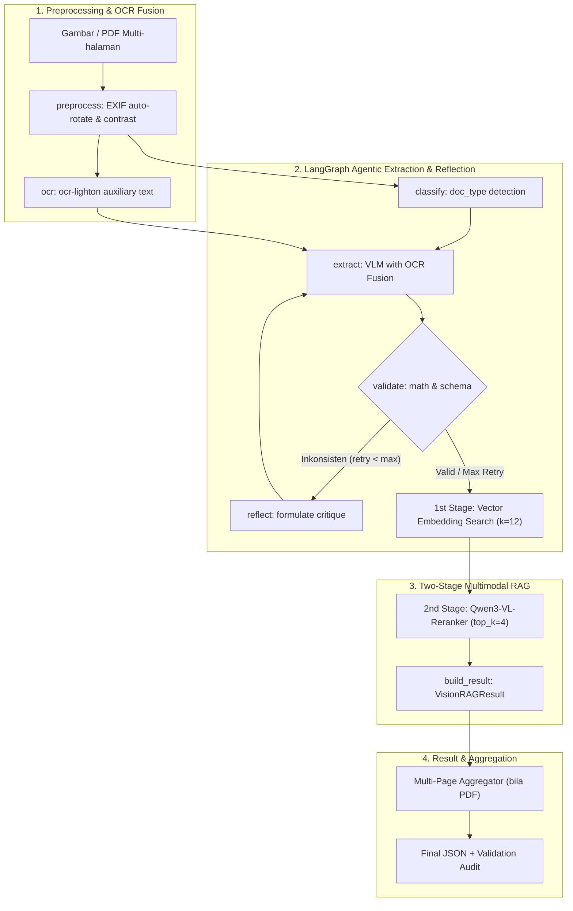

# jds-magang — Agentic Vision OCR RAG

Agent **Vision RAG Agentik** yang menggabungkan **VLM reasoning (`qwen-35b-vision`)**, **High-Resolution OCR (`ocr-lighton`)**, **Multimodal Embedding & Two-Stage Reranking (`Qwen3-VL-Embedding` + `Qwen3-VL-Reranker`)**, serta **Agentic Self-Correction & Reflection Loop** di LangGraph untuk mengekstrak dokumen (gambar tunggal / multi-page PDF) menjadi **JSON terstruktur** yang presisi dan tervalidasi.

- **VLM** : `qwen-35b-vision` (ekstraksi bebas + reasoning agent, structured output)
- **OCR** : `ocr-lighton` (VLM kecil tuned untuk auxiliary text & OCR grounding)
- **Embedding** : `Qwen3-VL-Embedding-2B` via `llama-vl-embedding` / transformers / HTTP
- **Reranker** : `Qwen3-VL-Reranker-2B` (Two-Stage Retrieval untuk refine presisi lintas modalitas)
- **Framework** : LangChain + LangGraph + Deep Agents + Pydantic v2 + PyMuPDF

---

## 🏗️ Arsitektur Agentic Pipeline



---

## 📁 Struktur Proyek

```
jds-magang/
├── app/                        # Modul Utama
│   ├── config.py               #   Settings: VLM, OCR, embedding, reranker + .env loader
│   ├── preprocess.py           #   Auto-orientasi EXIF & penyesuaian kontras dokumen
│   ├── llm.py                  #   Builder ChatOpenAI (VLM & OCR) + base64 image data URI
│   ├── ocr.py                  #   OCRExtractor (ocr-lighton -> teks mentah)
│   ├── validation.py           #   Validasi konsistensi matematika & kelengkapan data
│   ├── schemas.py              #   Pydantic Schemas (DocumentExtraction, ValidationSummary, MultiPage)
│   ├── prompts.py              #   System & user prompts + OCR fusion & reflection builder
│   ├── extractor.py            #   VisionExtractor (structured output + OCR context)
│   ├── agents.py               #   ExtractionAgent + AGENT_REGISTRY (9 jenis dokumen)
│   ├── embedding.py            #   VisionEmbedder + LlamaVLEmbeddings / transformers adapter
│   ├── reranker.py             #   Qwen3VLReranker multimodal reranking & scoring
│   ├── vector_store.py         #   VisionIndex (Two-Stage Retrieval + persistensi lokal)
│   ├── graph.py                #   VisionRAGPipeline (LangGraph Agentic Self-Reflection Loop)
│   ├── pdf.py                  #   Konversi PDF & agregasi dokumen multi-halaman
│   ├── deep_agent.py           #   Harness Deep Agents (create_deep_agent + 4 subagents)
│   └── report.py               #   Markdown report generator (VLM + OCR + Validasi)
├── scripts/
│   ├── download_dataset.py     #   Download sampel dataset FiftyOne -> input/datatest
│   ├── fix_dataset_paths.py    #   Perbaiki filepath dataset bila media dipindah
│   └── run_eval_report.py      #   Evaluasi kuantitatif (CER, WER, Recall) -> Markdown
├── main.py                     # CLI Utama
├── pyproject.toml / uv.lock    # Dependency (uv)
├── env.template                # Template konfigurasi .env
├── input/                      # Dataset & dokumen input
└── output/                     # Hasil ekstraksi JSON & laporan evaluasi
```

---

## ⚙️ Setup

```bash
# 1. Buat environment virtual (Python 3.12)
uv venv --prompt magang-jds .venv
uv pip install --python .venv deepagents langchain langgraph langchain-openai pydantic numpy Pillow pymupdf requests fiftyone huggingface-hub

# 2. Konfigurasi .env
cp env.template .env
#    -> Isi LLM_API_KEY di .env

# 3. (Opsional) Download dataset evaluasi
uv run --python .venv python scripts/download_dataset.py
```

---

## 🚀 Cara Pakai

```bash
# 1. Ekstraksi gambar tunggal (VLM + OCR Fusion + Validasi -> JSON)
uv run --python .venv python main.py gambar.png

# 2. Proses PDF multi-halaman penuh (otomatis diekstrak per halaman & diagregasikan)
uv run --python .venv python main.py dokumen.pdf

# 3. Ekstraksi dengan Two-Stage RAG context
uv run --python .venv python main.py gambar.png --query "cari nomor rekening dan nama pemilik"

# 4. Ingest pengetahuan katalog/aturan bisnis ke vector store sebelum query
uv run --python .venv python main.py gambar.png --ingest rules.json --query "kode SKU"

# 5. OCR terstruktur saja (ocr-lighton)
uv run --python .venv python main.py gambar.png --ocr

# 6. Hanya klasifikasi jenis dokumen
uv run --python .venv python main.py gambar.png --classify-only

# 7. Hanya konversi PDF menjadi gambar per-halaman
uv run --python .venv python main.py dokumen.pdf --pdf

# 8. Laporan evaluasi Markdown untuk seluruh gambar di folder
uv run --python .venv python main.py folder_gambar --report

# 9. Daftar jenis dokumen terdaftar
uv run --python .venv python main.py --list-agents
```

---

## 📊 Evaluasi Kuantitatif (CER, WER, Word Recall)

Jalankan evaluasi komparatif kuantitatif terhadap dataset FiftyOne:

```bash
# Evaluasi 100 gambar acak dengan metrik CER, WER, & Recall
uv run --python .venv python scripts/run_eval_report.py --samples 100

# Tes cepat (3 gambar dengan pacing cepat)
uv run --python .venv python scripts/run_eval_report.py --samples 3 --fast
```

Laporan di `output/eval_report.md` menghasilkan:
- **Tabel Ringkasan Metrik**: Rata-rata Character Error Rate (CER), Word Error Rate (WER), JSON Word Recall, dan Skor Validasi Konsistensi.
- **Audit Detail Per-Sampel**: Render gambar, Ground Truth kata-kata, hasil VLM JSON, teks OCR, dan log perbaikan refleksi bila terjadi ketidaksesuaian matematika.
