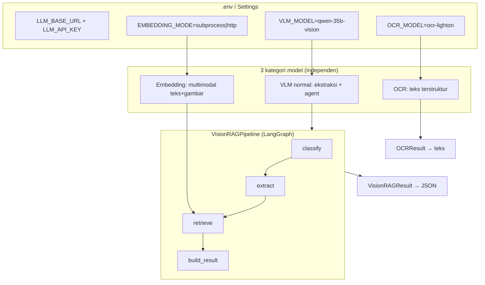
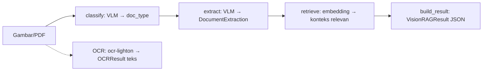

# jds-magang — Vision RAG Agent

Agent **RAG vision** yang menggabungkan **vision embedding multimodal**, **VLM agent**, dan **OCR terstruktur** untuk mengekstrak dokumen (gambar/PDF) menjadi **JSON terstruktur** yang valid.

- **VLM** : `qwen-35b-vision` (ekstraksi bebas + agent, structured output)
- **OCR** : `ocr-lighton` (VLM kecil tuned, output teks terstruktur)
- **Embedding** : Qwen3-VL-Embedding via `llama-vl-embedding` (llama.cpp, teks+gambar satu ruang vektor)
- **Framework** : LangChain + LangGraph + Deep Agents + Pydantic

---

## 🏗️ Arsitektur



- Setiap kategori model punya endpoint & nama sendiri, fallback ke `LLM_BASE_URL`/`LLM_API_KEY` global bila kosong → mudah menukar lokal (LM Studio) / server.
- `chat_template_kwargs.enable_thinking=false` dikirim otomatis ke VLM (lewat `extra_body`) agar tidak membuang token untuk thinking. **OCR tidak** (tidak perlu).

---

## 📁 Struktur Proyek

```
jds-magang/
├── app/                        # Kode utama
│   ├── config.py               #   Settings: VLM/OCR/embedding + loader .env
│   ├── llm.py                  #   build_vlm / build_ocr / image_data_uri
│   ├── ocr.py                  #   OCRExtractor (chat biasa, output teks)
│   ├── extractor.py            #   VisionExtractor (with_structured_output → Pydantic)
│   ├── agents.py               #   ExtractionAgent + AGENT_REGISTRY (9 jenis dokumen)
│   ├── embedding.py            #   VisionEmbedder + LlamaVLEmbeddings / LlamaServerEmbeddings
│   ├── vector_store.py         #   VisionIndex (InMemoryVectorStore, RAG)
│   ├── graph.py                #   VisionRAGPipeline (LangGraph: classify→extract→retrieve→result)
│   ├── deep_agent.py           #   build_deep_agent (create_deep_agent + subagents)
│   ├── pdf.py                  #   pdf_to_images (pymupdf, 200 DPI, <nama>_page<N>.jpg)
│   ├── schemas.py              #   Pydantic: DocumentClassification/Extraction, OCRResult, VisionRAGResult
│   └── prompts.py              #   Prompt general + per jenis dokumen
├── scripts/
│   ├── download_dataset.py     #   Download dataset FiftyOne → input/datatest
│   ├── fix_dataset_paths.py    #   Perbaiki filepath dataset (jika media dipindah)
│   └── run_eval_report.py      #   Evaluasi N gambar acak → laporan Markdown
├── main.py                     # CLI
├── pyproject.toml / uv.lock    # Dependency (uv)
├── env.template                # Template konfigurasi → salin ke .env
├── input/                      # Dataset (git LFS) + input pribadi (git-ignored)
├── output/                     # Laporan evaluasi (git-ignored)
└── archive/                    # Kode lama (TableRAG, vision_ocr, qwen3-vl-embedding)
```

---

## ⚙️ Setup

```bash
# 1. Environment (Python 3.12)
uv venv --prompt magang-jds .venv
uv pip install --python .venv deepagents langchain langgraph langchain-openai pydantic numpy Pillow pymupdf requests fiftyone

# 2. Konfigurasi
cp env.template .env
#    → isi LLM_API_KEY (satu-satunya yang perlu diisi untuk VLM + OCR)

# 3. (Opsional) Dataset evaluasi
uv run --python .venv python scripts/download_dataset.py
```

### Variabel `.env`

| Variabel | Default | Keterangan |
|---|---|---|
| `LLM_BASE_URL` | `http://localhost:1234/v1` | Endpoint global (fallback VLM & OCR) |
| `LLM_API_KEY` | — | **Wajib diisi** |
| `VLM_MODEL` | `qwen-35b-vision` | VLM ekstraksi + agent |
| `VLM_ENABLE_THINKING` | `false` | Kirim `chat_template_kwargs.enable_thinking` |
| `OCR_MODEL` | `ocr-lighton` | OCR terstruktur |
| `OCR_MAX_TOKENS` | `500` | Max token OCR |
| `EMBEDDING_MODE` | `subprocess` | `subprocess` (binary lokal) / `http` (llama-server) |
| `EMBEDDING_MODEL` | `Qwen3-VL-Embedding-2B-f16.gguf` | GGUF embedding |
| `EMBEDDING_MMPROJ` | — | Wajib untuk embedding gambar |
| `LLAMA_VL_EMBEDDING_BIN` | (PATH) | Binary `llama-vl-embedding` |

---

## 🚀 Cara Pakai

```bash
# Ekstraksi dokumen penuh (classify + extract + retrieve) → JSON
uv run --python .venv python main.py gambar.png

# Hanya klasifikasi jenis dokumen (tanpa embedding)
uv run --python .venv python main.py gambar.png --classify-only

# OCR terstruktur (ocr-lighton)
uv run --python .venv python main.py gambar.png --ocr

# Konversi PDF → gambar per halaman (<nama>_page<N>.jpg, 200 DPI)
uv run --python .venv python main.py dokumen.pdf --pdf

# Laporan Markdown: proses SEMUA gambar di folder → output/report.md
uv run --python .venv python main.py folder_gambar --report

# Laporan Markdown: satu gambar saja
uv run --python .venv python main.py gambar.png --report

# (report) lewati VLM / OCR / atur pacing rate limit
uv run --python .venv python main.py folder_gambar --report --skip-vlm
uv run --python .venv python main.py folder_gambar --report --ocr-interval 10 --vlm-interval 2

# Daftar jenis dokumen yang didukung
uv run --python .venv python main.py --list-agents
```

### Evaluasi 100 gambar acak → laporan Markdown

```bash
uv run --python .venv python scripts/run_eval_report.py --samples 100
# → output/eval_report.md (gambar + ground truth + VLM JSON + OCR text)

# Tes cepat (3 gambar, pacing dipercepat)
uv run --python .venv python scripts/run_eval_report.py --samples 3 --fast
```

Laporan menampilkan gambar (path relatif agar render), ground truth kata-kata dari label dataset (`words`), hasil VLM (doc_type + extraction JSON), dan teks OCR — untuk membandingkan hasil pipeline vs gambar asli.

---

## 🧠 Alur Pipeline



- **classify** : VLM klasifikasi jenis dokumen (structured output).
- **extract** : `ExtractionAgent` terpilih (sesuai doc_type) mengekstrak struktur bebas → validasi Pydantic.
- **retrieve** : query di-embed (Qwen3-VL) → cari di indeks vektor. *(Opsional; butuh binary embedding / mode http.)*
- **OCR** : jalur terpisah, output teks mentah terstruktur (tanpa thinking, max_tokens 500).

Alternatif agentic: `build_deep_agent()` membungkus semua kemampuan (extract / OCR / search) sebagai tools + subagents (`document-extractor`, `ocr`, `retriever`) di dalam `create_deep_agent`.

---

## 🚨 Catatan Penting

- **Rate limit server**: OCR `ocr-lighton` = **6 req/menit**, 8.000 token/menit; VLM = 40 req/menit, 5 concurrent. Script evaluasi sudah memberi pacing + retry otomatis.
- **Embedding opsional**: `main.py gambar.png` (pipeline penuh) menyentuh embedding di node `retrieve`. Kalau belum ada binary `llama-vl-embedding`, pakai `--classify-only` / `--ocr`, atau set `EMBEDDING_MODE=http`.
- **`with_structured_output`** (VLM) membutuhkan dukungan function calling / JSON schema di sisi server.
- **Dataset di git LFS**: `input/datatest` (~246MB) di-track via Git LFS (`.gitattributes`). Laptop lain perlu `git-lfs` terpasang untuk menarik isinya (`git lfs pull`).
- **Jaringan**: server `10.7.1.21` hanya bisa diakses dari jaringan server (WiFi/LAN internal). Kalau timeout, cek konektivitas dulu.

---

## 🗺️ Roadmap

- [x] Arsitektur 3 kategori model (VLM / OCR / embedding) + config `.env`
- [x] Pipeline LangGraph (classify → extract → retrieve → result)
- [x] Deep Agents harness + subagents
- [x] Konversi PDF → gambar
- [x] Script evaluasi Markdown (100 gambar acak)
- [x] Dataset `form_understanding_in_noisy_scanned_documents_plus` (FiftyOne)
- [ ] Build `llama-vl-embedding` (Vulkan/CPU) untuk embedding teks+gambar
- [ ] Fallback JSON-mode jika `with_structured_output` tidak didukung server
- [ ] Vector store persisten (Chroma/FAISS) + ingestion dokumen
