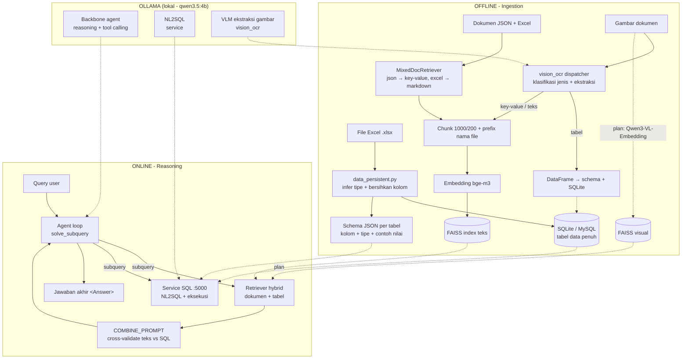
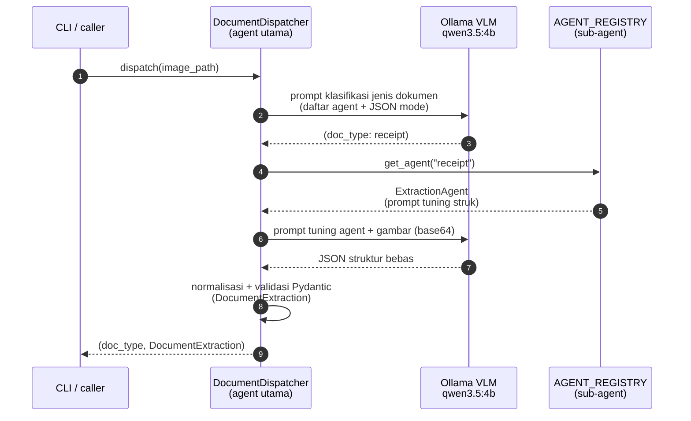
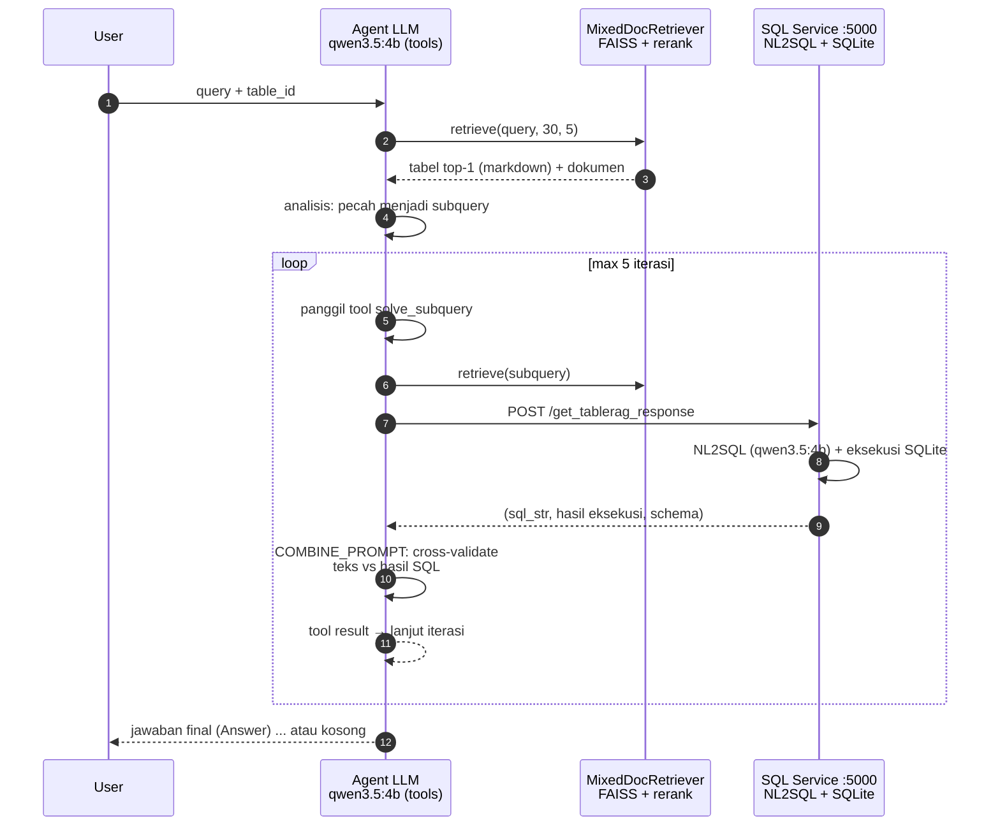
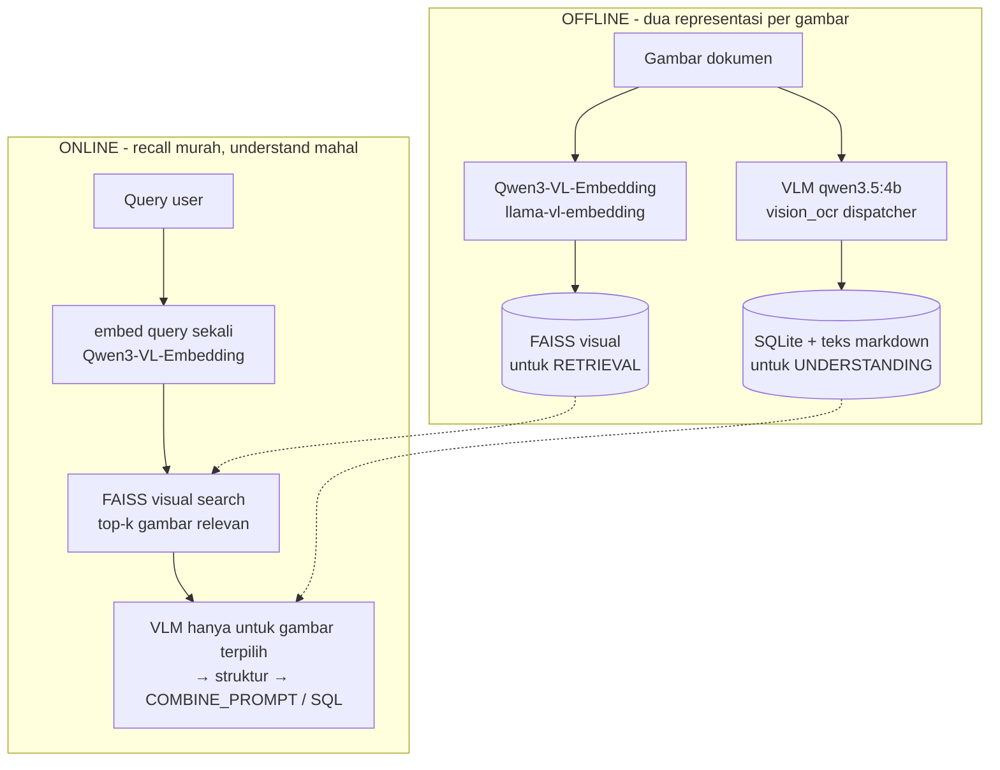
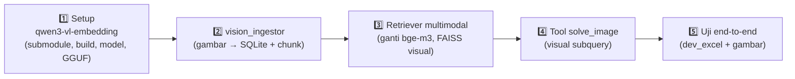

# jds-magang — TableRAG × Vision OCR (RAG Multimodal Lokal)

Proyek pengembangan **RAG multimodal 100% lokal** untuk reasoning di atas dokumen heterogen
(teks, tabel, dan gambar dokumen). Dibangun di atas dua repo upstream — **TableRAG**
(RAG hybrid: SQL execution + textual retrieval) dan **qwen3-vl-embedding** (embedding
multimodal VLM via llama.cpp) — lalu dikembangkan dengan ide sendiri
(**multi-agent VLM document extraction**).

Semua komponen LLM memakai **Ollama lokal** (`qwen3.5:4b`): backbone agent, NL2SQL, dan VLM ekstraksi gambar.

---

## 🏗️ Arsitektur Keseluruhan



**Alur ringkas:** dokumen disiapkan dua kali (SQL + embedding); saat query, agent memecah jadi
subquery → retriever mencari materi → service SQL menjawab kuantitatif → hasil digabung &
divalidasi → jawaban final. Gambar ditangani VLM (ekstraksi struktur) dan — pada tahap berikutnya —
embedding multimodal (retrieval visual).

---

## 📁 Struktur Proyek

```
jds-magang/
├── TableRAG/                        # Fork modifikasi dari yxh-y/TableRAG
│   ├── offline_data_ingestion_and_query_interface/
│   │   ├── config/                  #   database_config.json (type: sqlite / mysql)
│   │   ├── dataset/hybridqa/        #   dev_excel.zip (dataset HeteQA)
│   │   └── src/
│   │       ├── data_persistent.py   #   Excel → schema JSON + insert DB
│   │       ├── interface.py         #   Flask :5000 (endpoint /get_tablerag_response)
│   │       ├── service.py           #   NL2SQL → eksekusi SQL
│   │       ├── handle_requests.py   #   klien LLM (Ollama qwen3.5:4b)
│   │       └── sql_alchemy_helper.py#   helper SQLAlchemy (SQLite/MySQL)
│   └── online_inference/
│       ├── main.py                  #   Agent loop (solve_subquery)
│       ├── config.py                #   LLM = Ollama qwen3.5:4b
│       ├── prompt.py                #   SYSTEM_EXPLORE / COMBINE prompt
│       ├── chat_utils.py            #   OpenAI-compatible client
│       ├── tools/retriever.py       #   MixedDocRetriever (FAISS + rerank)
│       ├── tools/sql_tool.py        #   klien service SQL
│       └── evaluation/hybrid_eval.py#   evaluasi jawaban LLM
├── vision_ocr/                      # ⭐ IDE SENDIRI: multi-agent VLM extraction
│   ├── dispatcher.py                #   Agent utama: klasifikasi jenis → routing
│   ├── agents.py                    #   Registry 9 ExtractionAgent (prompt tuning)
│   ├── extractor.py                 #   Gambar → VLM → JSON → validasi Pydantic
│   ├── llm.py                       #   Backend modular (Ollama native / OpenAI-compatible)
│   ├── schemas.py                   #   Pydantic: DocumentExtraction (struktur bebas)
│   ├── embedder.py                  #   VisionEmbedder (wrapper llama-vl-embedding)
│   ├── prompts.py                   #   Prompt general (model tentukan struktur)
│   ├── cli.py                       #   CLI: auto-dispatch / paksa agent / klasifikasi
│   └── tests/                       #   Gambar uji (struk, tabel)
├── qwen3-vl-embedding/              # Fork ceveyne/qwen3-vl-embedding (belum di-setup)
│   └── scripts/                     #   Convert GGUF + regression script
├── input/                           # Gambar input pengguna (git-ignored)
└── .gitignore
```

---

## ✅ Status Sekarang

| Komponen | Status | Detail |
|---|---|---|
| **TableRAG pipeline** | ✅ Dimodifikasi | Backend DB → **SQLite** (MySQL tetap ada di config); LLM → **Ollama qwen3.5:4b**; prompt NL2SQL → SQLite syntax; ~15 bug runtime & type-checker diperbaiki (`ty check` bersih) |
| **vision_ocr** | ✅ Berfungsi & teruji | Multi-agent VLM extraction: klasifikasi jenis + ekstraksi struktur bebas + validasi Pydantic |
| **Model lokal** | ✅ Terverifikasi | Ollama `qwen3.5:4b` (VLM + tools + thinking): tool calling `solve_subquery` berhasil |
| **qwen3-vl-embedding** | ⏳ Belum di-setup | Submodule belum init; binary `llama-vl-embedding` belum dibuild; model 2B/8B belum didownload |
| **Repo** | ✅ Satu git tunggal | Private: `github.com/daruoktab/jds-magang` |

### Hasil uji `vision_ocr` (model `qwen3.5:4b`)

| Skenario | Klasifikasi | Hasil |
|---|---|---|
| Struk belanja Euro | `receipt` | Merchant, tanggal ISO (`2023-12-12`), 6 item (harga numerik + `currency: EUR`), `subtotal 20.45`, `tax 3.6`, `total 24.05`, `change 0.95` — semua akurat |
| Tabel data | `table` | `{columns, rows}` — 3 kolom, 4 baris, akurat |
| Mode generic | — | Model menentukan sendiri key-value & struktur terbaik (termasuk field yang tidak diminta) |

---

## 🧠 Alur Multi-Agent `vision_ocr` (agent utama + sub-agent)



- **Agent utama** (`DocumentDispatcher`): satu panggilan VLM untuk klasifikasi jenis → pilih sub-agent.
- **Sub-agent** (`ExtractionAgent`): prompt tuning per jenis (receipt, invoice, table, form,
  business_card, bank_statement, label, screenshot, generic-fallback) — struktur output tetap
  ditentukan model.
- **Modular**: tambah jenis dokumen = tambah 1 entry di `AGENT_REGISTRY`; tiap agent bisa punya
  model sendiri; backend LLM bisa diganti (Ollama / OpenAI-compatible).

---

## 🔄 Alur Agent TableRAG (solve_subquery)



---

## 💡 Ide: Combine VLM + Embedding Multimodal (pola TableRAG)

Prinsip yang dipinjam dari TableRAG: **simpan 2 representasi, recall murah dulu, understand mahal belakangan**.



- **Embedding multimodal** (bge diganti total): satu model untuk teks, tabel markdown, dan gambar
  — semua dalam satu ruang vektor.
- **VLM** hanya dipanggil untuk top-k hasil retrieval — hemat token/waktu (persis alasan TableRAG
  pakai SQL ketimbang baca tabel utuh).
- **Extension agent**: tool baru `solve_image` di agent loop untuk "visual subquery" (gambar
  dipertanyakan saat query → `vision_ocr` → hasil masuk `COMBINE_PROMPT`).

---

## 🗺️ Plan Sementara (Roadmap)



| # | Langkah | Detail |
|---|---|---|
| 1 | **Setup `qwen3-vl-embedding`** | `git submodule update --init --recursive`; build `llama-vl-embedding` (Windows: `cmake --build llama.cpp/build --target llama-vl-embedding`); download Qwen3-VL-Embedding-2B/8B; convert GGUF (main `f16` + `--mmproj f16`) |
| 2 | **`vision_ingestor.py`** | Offline: hasil `vision_ocr` → `TableData` jadi DataFrame → SQLite + schema JSON; key-value → chunk. Gambar ikut pipeline SQL seperti `.xlsx` |
| 3 | **Retriever multimodal** | Extend `MixedDocRetriever`: `VisionEmbedder` (Qwen3-VL) ganti bge-m3; index FAISS visual paralel; query di-embed sekali → fusion skor → top-k |
| 4 | **Tool `solve_image`** | Agent memanggil `vision_ocr` untuk subquery visual; hasil masuk `COMBINE_PROMPT` |
| 5 | **Uji end-to-end** | Ingestion `dev_excel.zip` + gambar → service SQL → agent loop → evaluasi (`hybrid_eval.py`) |

---

## 🚀 Menjalankan

```bash
# 1. Environment
conda activate magang-jds          # Python 3.12; torch diinstall manual
uv pip install -r TableRAG/requirements.txt
ollama serve                       # + ollama pull qwen3.5:4b

# 2. Vision OCR (gambar → struktur)
python -m vision_ocr.cli input/gambar.jpg                  # auto: klasifikasi + agent terbaik
python -m vision_ocr.cli input/gambar.jpg --agent receipt  # paksa agent tertentu
python -m vision_ocr.cli --list-agents                     # daftar jenis dokumen

# 3. TableRAG offline (ingestion + service SQL)
cd TableRAG/offline_data_ingestion_and_query_interface/src
python data_persistent.py          # Excel → SQLite (config: database_config.json)
python interface.py                # Flask :5000 (NL2SQL via qwen3.5:4b)

# 4. Agent loop
cd TableRAG/online_inference
python main.py --data_file_path <cases.json> --doc_dir <docs> --excel_dir <excels> --backbone v3
```

> **Catatan jaringan**: `git push` via protokol `github.com` tidak stabil di jaringan ini; push rutin
> sebaiknya via `git@ssh.github.com:443` (SSH) atau Git Data API.
