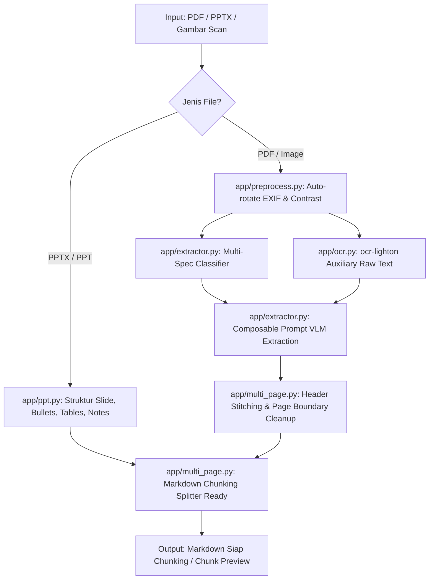

# jds-magang — Vision OCR & Document Extractor (Ready for Chunking)

Sistem ekstraksi dokumen multimodal (PDF, PPT/PPTX, Scan Gambar) menjadi **Markdown bersih dan terstruktur yang siap langsung di-chunking** untuk pipeline RAG downstream.

> ℹ️ **Catatan Branch:** 
> Fitur lengkap pipeline RAG end-to-end (Embedding `Qwen3-VL-Embedding`, Reranker `Qwen3-VL-Reranker`, dan Vector Store) tersimpan di branch `end-to-end`. Branch `main` difokuskan pada pipeline ekstraksi dokumen ke format Markdown siap chunking.

---

## 🎯 4 Spesifikasi Karakteristik Dokumen (Mendukung Multi-Spesifikasi Komposit)

Sistem mendukung ekstraksi dengan satu atau **beberapa spesifikasi sekaligus secara komposit** (*Composable Prompts*), misalnya jurnal ilmiah multi-halaman yang membutuhkan aturan 2-kolom sekaligus kontinuitas heading antar-halaman (`bilingual_journal` + `markdown_hierarchy`):

| No | Spesifikasi Layout | Karakteristik & Perilaku Ekstraksi | Target Output |
|:---:|:---|:---|:---|
| **1** | `plain` | **Dokumen Biasa / Standar**<br>Dokumen umum (memo, formulir, surat, nota) yang tidak memerlukan perlakuan hierarki khusus. OCR langsung diekstrak menjadi teks/markdown bersih. | Paragraf rapi, tabel standar GFM |
| **2** | `markdown_hierarchy` | **Hierarki Markdown Berkelanjutan**<br>Dokumen bertingkat (`#`, `##`, `###`). Menjaga konsistensi judul ketika berpindah halaman (multi-page) dan menyambungkan kalimat terpotong tanpa merusak struktur. | Hierarki heading utuh, eliminasi page header/footer berulang |
| **3** | `bilingual_journal` | **Jurnal Ilmiah / Dokumen 2-Kolom & 2-Bahasa**<br>Membaca kolom kiri dari atas ke bawah sampai selesai, lalu melanjutkan ke kolom kanan. Menjaga koherensi teks bilingual berdampingan. | Urutan baca logis berurutan (tidak melompat antar-kolom) |
| **4** | `presentation_slides` | **Slide Presentasi (PPT / PPTX / Slide PDF)**<br>Slide yang sarat poin-poin/bullet list, tabel ringkas, speaker notes, serta penanda visual/diagram `[Diagram: ...]`. | Markdown per-slide yang siap dipartisi per topik |

---

## 🤖 Arsitektur Sub-Agent (Deep Agents Harness)

Proyek ini dilengkapi dengan **Master Agent dan 6 Sub-Agent Spesialis** ([app/deep_agent.py](file:///c:/Users/HYPE%20AMD/Documents/Coding/jds-magang/app/deep_agent.py)) yang mendelegasikan tugas secara otonom:

| Nama Sub-Agent | Peran & Spesialisasi | Tool Utama |
|:---|:---|:---|
| `ocr-specialist` | Pembacaan teks mentah literal tingkat tinggi tanpa halusinasi | `ocr_document` (`ocr-lighton`) |
| `layout-classifier` | Deteksi multi-trait tata letak dokumen (kolom, hierarki, slide, tabel) | `classify_layout` |
| `markdown-extractor` | Ekstraksi gambar multimodal ke Markdown bersih berbasis spesifikasi komposit | `extract_to_markdown` |
| `presentation-specialist` | Ekstraksi slide PowerPoint (.pptx) dengan hierarki bullet, tabel, dan notes | `extract_presentation_pptx` |
| `pdf-orchestrator` | Orkestrasi pemrosesan PDF multi-halaman & penyambungan kontinuitas heading | `extract_pdf_document` |
| `chunking-simulator` | Evaluasi kesiapan partisi Markdown dengan header splitter & recursive splitter | `preview_chunks` |

---

## 🏗️ Alur Pipeline Ekstraksi



---

## 📁 Struktur Modul

```
jds-magang/
├── app/
│   ├── config.py          # Pengaturan model VLM, OCR, dan API Key
│   ├── preprocess.py      # Auto-orientasi EXIF & optimasi kontras dokumen
│   ├── llm.py             # Builder ChatOpenAI & helper base64 image data URI
│   ├── ocr.py             # Model OCR tuned (ocr-lighton) untuk pembacaan teks mentah
│   ├── prompts.py         # Modul prompt modular berlapis (Composable Prompts)
│   ├── schemas.py         # Pydantic schemas (ExtractedDocument, DocumentPage, ChunkItem)
│   ├── extractor.py       # Ekstraksi multimodal VLM -> Markdown (Multi-label)
│   ├── agents.py          # Registry Agent komposit untuk kombinasi spesifikasi
│   ├── ppt.py             # Parser presentasi PowerPoint (.pptx)
│   ├── pdf.py             # Multi-page PDF renderer & stitcher
│   ├── multi_page.py      # Penyambung halaman kontinu & simulasi chunking
│   ├── graph.py           # Pipeline LangGraph DocumentExtractionPipeline
│   └── deep_agent.py      # Harness Deep Agents dengan 6 subagents spesialis
├── main.py                # Antarmuka CLI utama
├── pyproject.toml         # Konfigurasi dependensi
└── README.md
```

---

## ⚙️ Instalasi & Persiapan

Gunakan `uv` untuk instalasi paket:

```powershell
# 1. Buat virtual environment
uv venv --prompt magang-jds .venv

# 2. Aktifkan venv & install dependensi
.venv\Scripts\Activate.ps1
uv pip install -U -r pyproject.toml
```

Buat file `.env` (salin dari template bila perlu):
```env
LLM_API_KEY=your_api_key_here
LLM_BASE_URL=http://localhost:1234/v1
VLM_MODEL=qwen-35b-vision
OCR_MODEL=ocr-lighton
```

---

## 🚀 Panduan Penggunaan CLI

### 1. Ekstraksi Dokumen ke Teks Markdown

```powershell
# Ekstrak PDF multi-halaman
python main.py dokumen.pdf

# Ekstrak file presentasi PowerPoint
python main.py presentasi.pptx

# Ekstrak gambar hasil scan / foto dokumen
python main.py scan_dokumen.jpg
```

### 2. Menjalankan via Deep Agent Harness & Sub-Agents (`--agent`)

```powershell
# Eksekusi dengan delegasi otonom ke sub-agents
python main.py dokumen.pdf --agent
```

### 3. Menyimpan Output ke File Markdown (`-o` / `--out`)

```powershell
python main.py laporan_tahunan.pdf -o output/laporan.md
```

### 4. Simulasi & Preview Chunking LangChain (`--preview-chunks`)

Menampilkan bagaimana teks Markdown yang diekstrak akan dipecah oleh `MarkdownHeaderTextSplitter` dan `RecursiveCharacterTextSplitter`:

```powershell
python main.py dokumen.pdf --preview-chunks --chunk-size 1000 --chunk-overlap 150
```

### 5. Memilih Spesifikasi Tunggal / Multi-Spesifikasi Komposit (`-t` / `--type`)

Secara default, pipeline akan melakukan klasifikasi multi-label secara otomatis. Anda juga dapat memaksa kombinasi spesifikasi tertentu:

```powershell
# 1. Spesifikasi Tunggal: Dokumen biasa
python main.py formulir.pdf --type plain

# 2. Spesifikasi Tunggal: Dokumen hierarki bab
python main.py buku_panduan.pdf --type markdown_hierarchy

# 3. Spesifikasi Tunggal: Jurnal ilmiah 2-kolom
python main.py jurnal.pdf --type bilingual_journal

# 4. Multi-Spesifikasi Komposit (Jurnal 2-Kolom + Hierarki Bab Kontinu):
python main.py jurnal_lengkap.pdf --type journal,hierarchy

# 5. Multi-Spesifikasi Komposit (Slide Presentasi + Hierarki):
python main.py slide_modul.pdf --type slide,hierarchy
```

### 6. Melihat Daftar Spesifikasi yang Didukung

```powershell
python main.py --list-types
```
